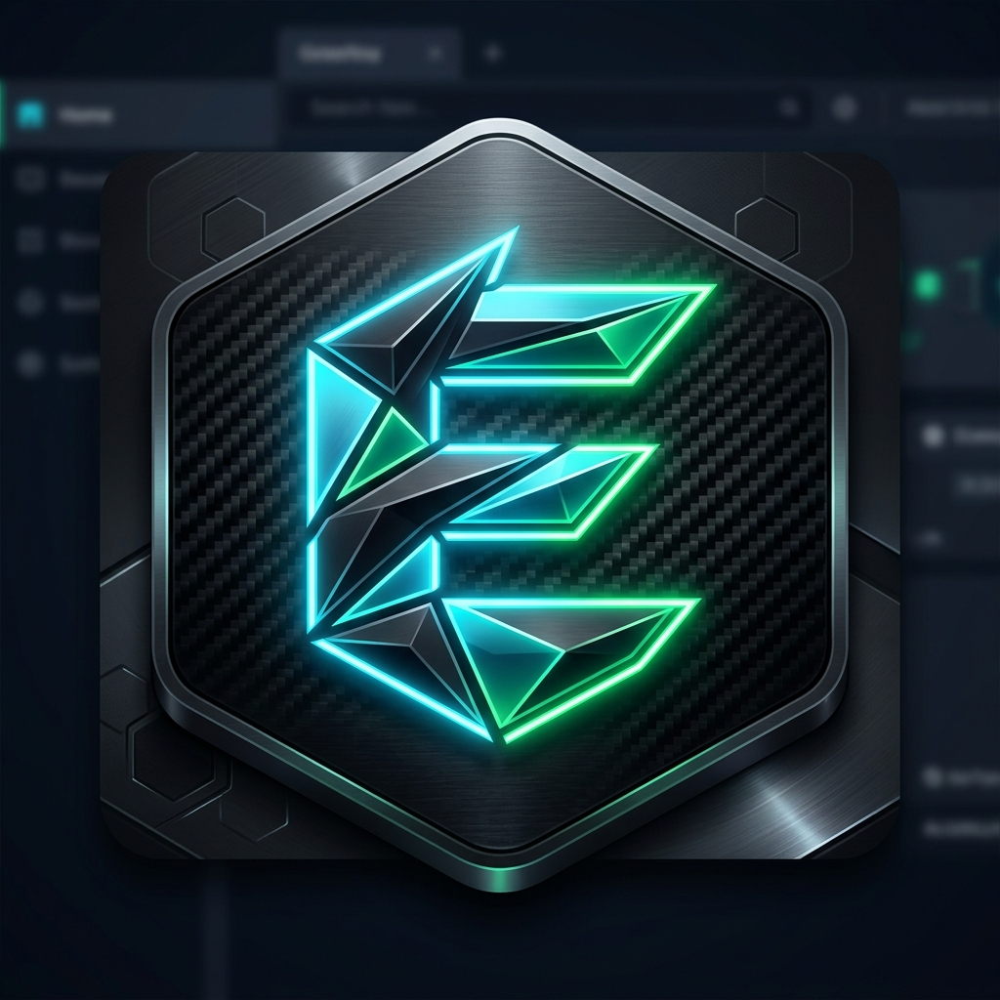
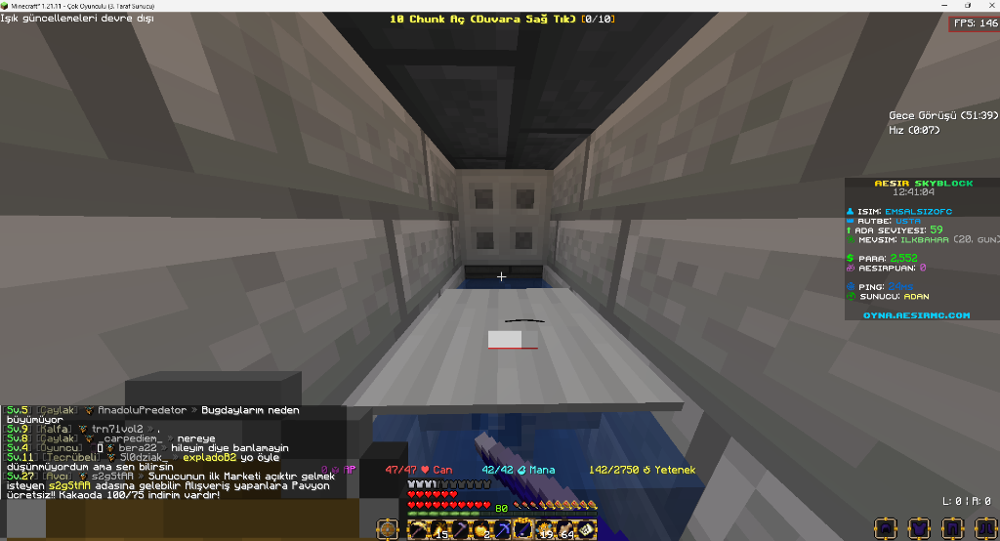
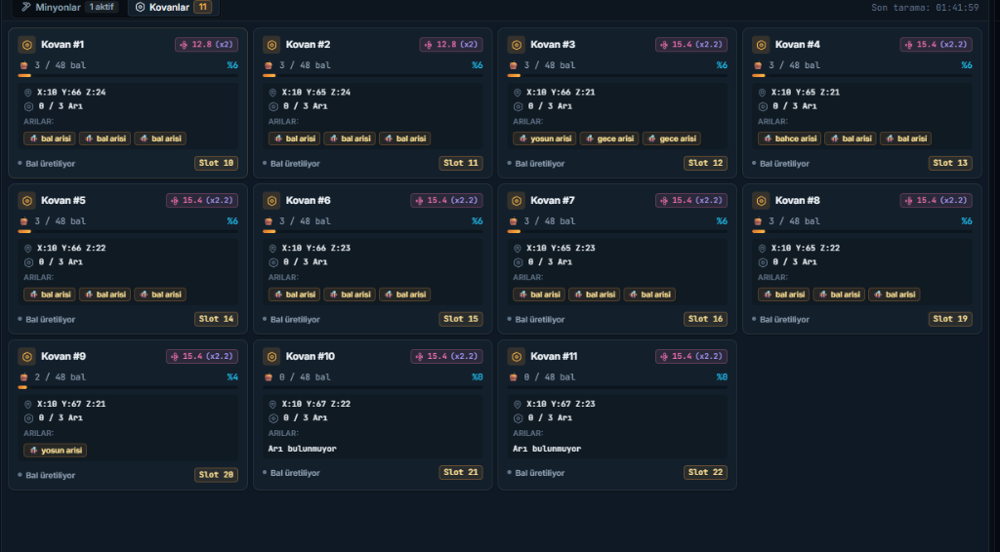

<div align="center">

  

  # 👑 EmsalClient
  **Profesyonel Minecraft AFK, Ada & Minyon Otomasyon İstemcisi**

  [](https://github.com/YusufcanEsener/EmsalClient/releases)
  [](https://github.com/YusufcanEsener/EmsalClient)
  [](https://nodejs.org)
  [](https://github.com/YusufcanEsener)

  <p align="center">
    <b>EmsalClient</b>, gelişmiş Mineflayer motoru, donanım seviyesinde şifre koruması (DPAPI), dinamik arı kovanı/minyon takibi ve modern karanlık masaüstü arayüzü ile donatılmış yeni nesil bir Minecraft AFK yönetim platformudur.
  </p>
</div>

---

## 📸 Ekran Görüntüleri

### 🖥️ 1. Modern Kontrol Paneli (Dashboard)
Linear ve Raycast tasarım dillerinden ilham alan ultra hızlı karanlık tema, anlık sunucu durumu ve kovan takip paneli:

<div align="center">
  
</div>

<br/>

### 🍯 2. Canlı Kovan Durumu & Otomatik Bal Hasadı
Arı kovanlarındaki bal doluluğunu gerçek zamanlı izler, doluluk oranı **%80'i aştığında** otomatik şişe alıp hasat eder ve sandığa teslim eder:

<div align="center">
  
</div>

---

## ⚡ Temel Özellikler

| Özellik | Açıklama |
|---|---|
| **🤖 Gelişmiş Bot Motoru** | Mineflayer altyapısı, otomatik ada ışınlanması (`/is go`), ölüm/kopma koruması ve otomatik yeniden bağlanma. |
| **🍯 Otomatik Bal Hasadı** | %80 doluluk filtresi, sandıktan boş cam şişe alma, kovanlardan bal toplama ve sandığa geri aktarma döngüsü. |
| **📊 Canlı Scoreboard Takibi** | Sunucudaki canlı tabloyu (Scoreboard) anlık okur. Botun Skyblock'ta mı yoksa Lobide mi olduğunu tepede dinamik gösterir. |
| **🎒 Canlı Envanter Paneli** | Çanta (36 slot), hotbar ve zırh durumunu Minecraft piksel ikonlarıyla gecikmesiz gösterir. |
| **🔒 Donanım Seviyesinde Güvenlik** | Şifreler asla düz metin saklanmaz; Windows DPAPI + AES-256-GCM ile şifrelenir. Arayüze veya dışa aktarılan JSON dosyalarına şifre sızdırılmaz. |
| **👥 Çoklu Profil Yönetimi** | Farklı hesaplar ve sunucular için tek tıkla profil oluşturma, kopyalama ve profiller arası anında geçiş. |
| **🔄 Otomatik Güncelleme** | Uygulama açılışında GitHub Releases denetimi, zorunlu güncelleme kilidi ve arka planda sessiz indirme. |
| **🗔 Sistem Tepsisi (Tray)** | Arka planda kesintisiz çalışma, durum göstergeleri ve hızlı eylem menüsü. |

---

## 🚀 Kurulum ve Çalıştırma

### 1. Hazır `.exe` İle Başlatma
1. [Releases](https://github.com/YusufcanEsener/EmsalClient/releases) sayfasından en son sürümü indirin:
   - **`EmsalClient-portable.exe`**: Kurulum gerektirmez, doğrudan çift tıklayıp çalıştırabilirsiniz.
   - **`EmsalClient Setup 1.0.0.exe`**: Masaüstü ve başlat menüsü kısayolları oluşturan kurulumlu sürüm.
2. Uygulamayı açın, profil ayarlarınızı yapılandırın ve **"Başlat"** butonuna basın.

### 2. Kaynak Koddan Geliştirici Olarak Çalıştırma
Gereksinim: **Node.js >= 22.0.0**

```bash
# Depoyu klonlayın
git clone https://github.com/YusufcanEsener/EmsalClient.git

# Proje dizinine girin
cd EmsalClient

# Bağımlılıkları yükleyin
npm install

# Geliştirici modunda başlatın
npm start

# Otomatik test süitini çalıştırın
npm test
```

### 3. Kendi `.exe` Dosyanızı Derleme (Build)
```bash
# Taşınabilir (Portable) tek dosya EXE üretir (dist/ dizininde):
npm run build

# Hem Kurulumlu (NSIS) hem Portable EXE üretir:
npm run dist
```

---

## 🛡️ Güvenlik Mimarisi
- **Zero-PlainText**: `main.js` veya ayar dosyalarında açık hesap şifresi barındırılmaz.
- **Export Sanitization**: Profil JSON yedekleri alınırken şifreler otomatik olarak filtrelenir ve yedek dosyasına dahil edilmez.
- **IPC Validation**: Renderer process ile Node.js Main process arasındaki tüm iletişim ad alanlı (namespaced) ve katı tip denetimlidir.

---

## 👑 Geliştirici & Lisans
- **Geliştirici**: [EmsalSiz](https://github.com/YusufcanEsener)
- **Lisans**: ISC License
